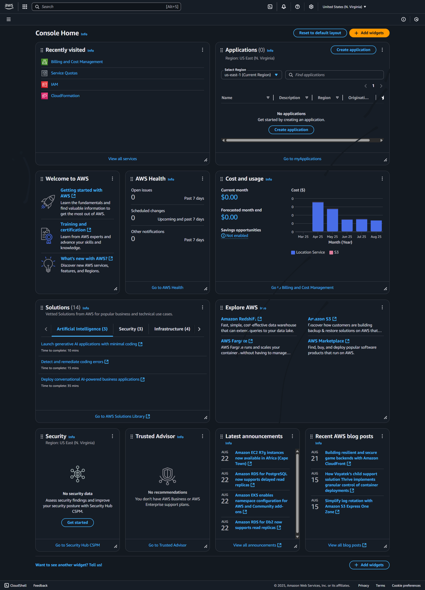
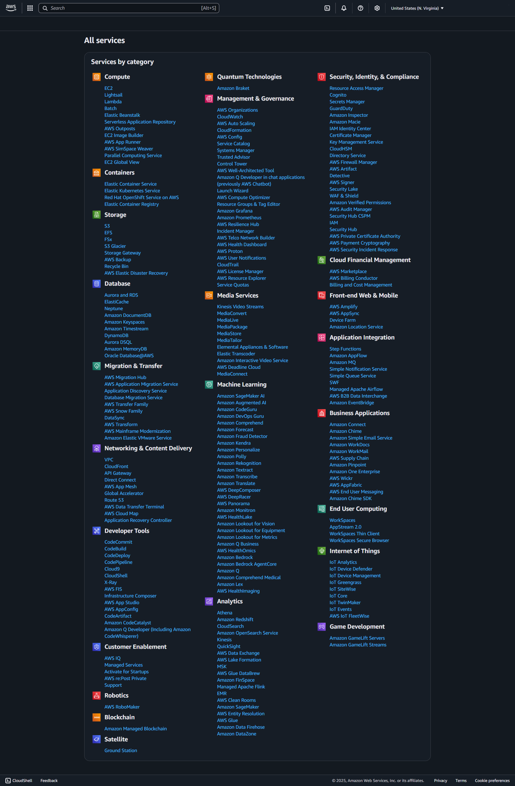

# Aim
To create a cloud account in AWS and to explore all of its services.

---

# Procedure  

### Step 1: Go to the AWS Website  
- Visit [https://aws.amazon.com](https://aws.amazon.com)  
- Click *“Create an AWS Account”* in the top right corner.  

---

### Step 2: Enter Account Information  
- *Email address* – Use a valid email you have access to.  
- *Password* – Create a strong password.  
- *AWS account name* – The name to associate with your AWS account (e.g., your name or company name).  

---

### Step 3: Choose Account Type  
- Select *Personal* or *Professional* based on your intended usage.  
- Fill in your *contact information* (name, address, phone number).  

---

### Step 4: Enter Payment Information  
- Provide *credit/debit card details*.  
> *Note:* You won’t be charged immediately. AWS offers a *Free Tier*, but entering payment details is mandatory.  

---

### Step 5: Verify Your Identity  
- Enter your *phone number*.  
- AWS will send a *verification code via call or text*.  
- Enter the code to confirm your identity.  

---

### Step 6: Choose a Support Plan  
- Available options:  
  - *Basic Support (Free)*  
  - *Developer Support*  
  - *Business Support*  
  - *Enterprise Support*  

> For beginners, select *Basic Support*.  

---

### Step 7: Complete the Sign-Up  
- Review all the details and click *Sign Up*.  
- You’ll receive a *confirmation email* once your account is activated (usually within a few minutes).  

---

### Step 8: Sign In to AWS Console  
- Go to [https://console.aws.amazon.com](https://console.aws.amazon.com).  
- Log in using your *email* and *password* to start using AWS services.  

---

# Create a User with Administrative Access  

After signing up for AWS, it’s important to secure your root user, enable *IAM Identity Center, and create an **administrative user*.  

---

## Secure Your AWS Account Root User  
1. Sign in to the [AWS Management Console](https://console.aws.amazon.com) as the *root user* (choose *Root user* and enter your account email and password).  
2. Turn on *multi-factor authentication (MFA)* for your root user.  

---

## Create User with Administrative Access  
1. Enable *IAM Identity Center*.  
2. In IAM Identity Center, grant *administrative access* to a user.  

---

## Sign In as the User with Administrative Access  
- Use the *sign-in URL* sent to your email address when creating your IAM Identity Center user.  

---

# Services Overview  
- Explore all the available services on the *AWS platform*.  

---

# Output

---

# Result  
Thus, an account was created in the AWS platform and all the services were explored.
