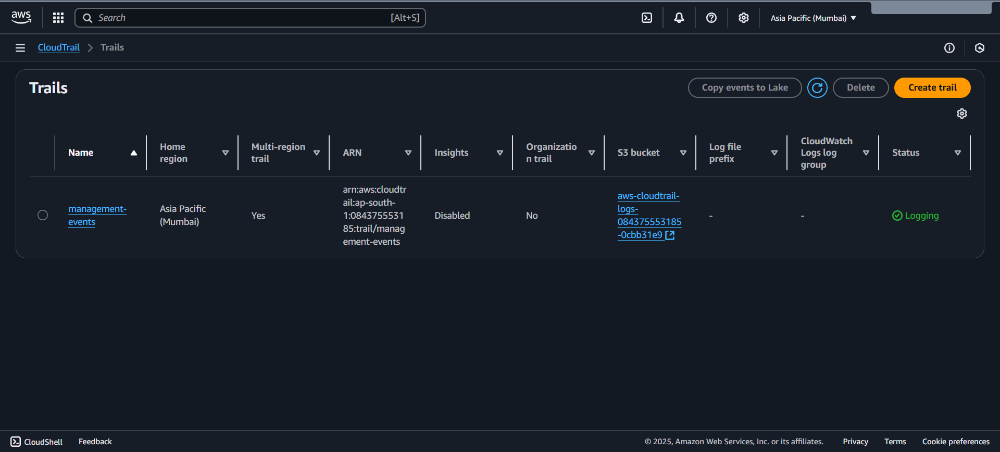

# Aim

To create a cloud account in AWS and to explore all of its services.

---

# Procedure

### Step 1: Go to the AWS Website

- Visit [https://aws.amazon.com](https://aws.amazon.com)
- Click _“Create an AWS Account”_ in the top right corner.

---

### Step 2: Enter Account Information

- _Email address_ – Use a valid email you have access to.
- _Password_ – Create a strong password.
- _AWS account name_ – The name to associate with your AWS account (e.g., your name or company name).

---

### Step 3: Choose Account Type

- Select _Personal_ or _Professional_ based on your intended usage.
- Fill in your _contact information_ (name, address, phone number).

---

### Step 4: Enter Payment Information

- Provide _credit/debit card details_.
  > _Note:_ You won’t be charged immediately. AWS offers a _Free Tier_, but entering payment details is mandatory.

---

### Step 5: Verify Your Identity

- Enter your _phone number_.
- AWS will send a _verification code via call or text_.
- Enter the code to confirm your identity.

---

### Step 6: Choose a Support Plan

- Available options:
  - _Basic Support (Free)_
  - _Developer Support_
  - _Business Support_
  - _Enterprise Support_

> For beginners, select _Basic Support_.

---

### Step 7: Complete the Sign-Up

- Review all the details and click _Sign Up_.
- You’ll receive a _confirmation email_ once your account is activated (usually within a few minutes).

---

### Step 8: Sign In to AWS Console

- Go to [https://console.aws.amazon.com](https://console.aws.amazon.com).
- Log in using your _email_ and _password_ to start using AWS services.

---

# Create a User with Administrative Access

After signing up for AWS, it’s important to secure your root user, enable _IAM Identity Center, and create an \*\*administrative user_.

---

## Secure Your AWS Account Root User

1. Sign in to the [AWS Management Console](https://console.aws.amazon.com) as the _root user_ (choose _Root user_ and enter your account email and password).
2. Turn on _multi-factor authentication (MFA)_ for your root user.

---

## Create User with Administrative Access

1. Enable _IAM Identity Center_.
2. In IAM Identity Center, grant _administrative access_ to a user.

---

## Sign In as the User with Administrative Access

- Use the _sign-in URL_ sent to your email address when creating your IAM Identity Center user.

---

# Services Overview

- Explore all the available services on the _AWS platform_.

---

# Output

# Result

Thus, an account was created in the AWS platform and all the services were explored.
